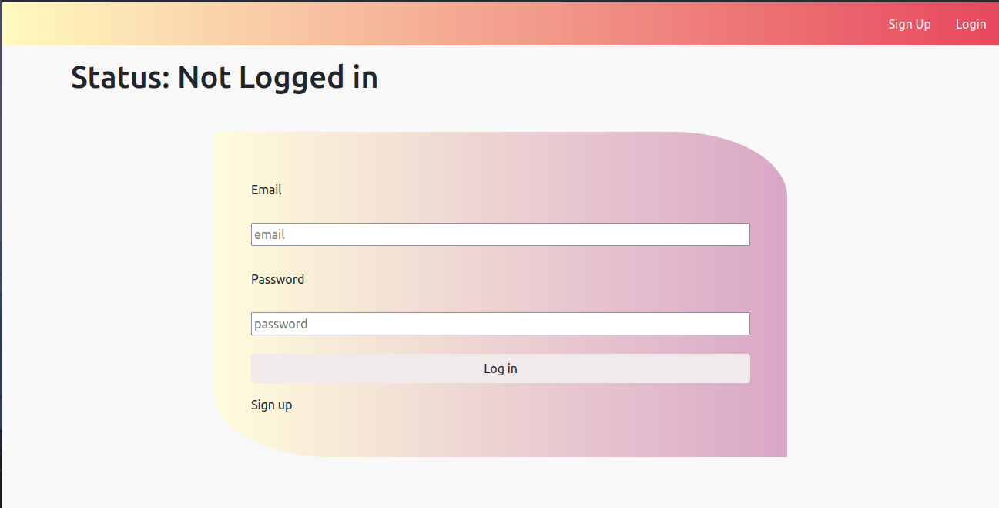

# React-Rails Authentication Front-End

    
  <h3 align="center">React-Rails --> [React]</h3>

  

This is prepared React authentication `part of React-Rails authentication` where components and complete logic are built and ready to use.
  

 - Clone the repo to your local machine.

 - cd inside the project directory.

  - npm install

 - run npm run start

**Step 2 Rails Part** 

In order to use this project you should have the back end prepared, I will put the link to the Rails back-end [Here](https://www.linkedin.com/in/ari-karim-523bb81b3) and all you have to to is follow these simple : 

- Clone the Rails repo and cd inside the project.

- Run `Rake secret` and hold it for the next step.

- Create a `.env` file in the root of the project and inside it put this `DEVISE_JWT_SECRET_KEY = < your secret key from previuos step >`

- Inside `config/initializers/cors.rb` if you it locally you dont need to do this but if you want to use it from specific domain you should change line 12 from `origins '*'` to `origins 'Your domain here'`.

## 🤝 contributing

## Author

- GitHub: [@arikarim](https://github.com/arikarim)
- LinkedIn: [AriKarim](https://www.linkedin.com/in/ari-karim-523bb81b3)

## 🙋‍♂ show your support

give a ⭐️ if you like this project!

## 📝 license

This project is [MIT](lisenced)
